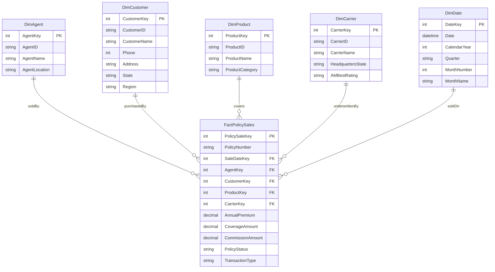

# Insurance Policy Sales Schema

Each fact row represents a policy issuance or renewal transaction. Dimension keys are referenced by `FactPolicySales`; each dimension can relate to many policy transactions.
